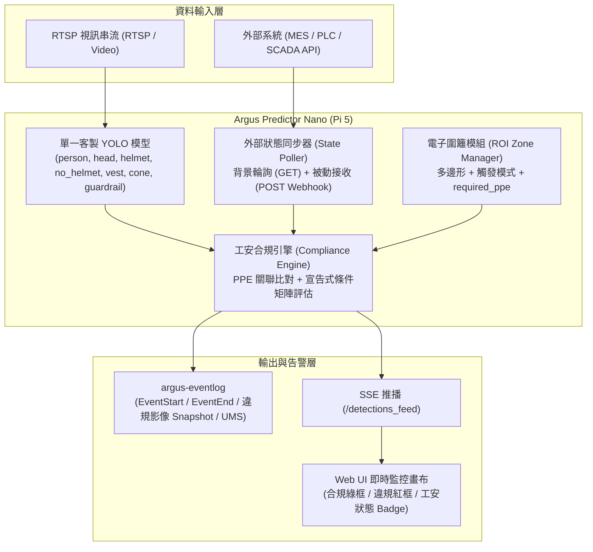

# Spec: 人員裝備防護 (PPE) 與條件式工安合規規則引擎 (PPE Detection & Conditional Compliance Rule Engine)

## Problem Statement

目前 Argus Safety Predictor Nano 已具備基礎的單目標偵測與多邊形電子圍籬 (ROI Zone Intrusion) 判定功能。然而在工業現場與廠務工安實際運作中，面臨以下三大核心限制：

1. **缺乏裝備防護 (PPE) 檢測與彈性關聯機制**：
   - 無法判定現場人員是否確實配戴安全帽 (`helmet`) 或穿著反光背心 (`vest`)。
   - 不同場景（俯視遠景 vs 人員走動遮擋 vs 彎腰作業）對 PPE 判定的演算法要求不同，若只用單一硬編碼規則容易產生大量誤報 (False Alarms) 或漏報。
2. **缺乏條件式工安合規判定 (Conditional Safety Compliance)**：
   - 工安作業要求往往不是單一物件的入侵，而是複合條件。例如：在進行「機台維護」作業時，人員打開設備門並進入區域，現場**必須**同時設置「三角錐 (`cone`)」或「安全護欄 (`guardrail`)」作為阻隔，且人員必須穿戴完整 PPE；若任一防護缺失即構成工安違規。
3. **缺乏外部設備狀態 (External Equipment State) 邊緣感知能力**：
   - 工安規則通常與現場機台運轉模式連動（如：設備處於「維護中 (MAINTENANCE)」、「運轉中 (RUNNING)」、「異常停機 (ALARM)」）。邊緣端若無法獲取外部 MES/PLC 狀態，便無法動態啟用對應等級的安防規則。

---

## Solution & Architecture

採用**邊緣端輕量規則引擎 (Edge Lightweight Rule Engine) + 雙模 PPE 關聯比對 + 外部狀態雙軌同步 (Polling & Webhook)** 架構：



### 核心設計原則：
1. **單一模型端到端推論 (Single YOLO Model)**：在 Pi 5 CPU 上僅運行單一客製 YOLO 模型，輸出全部基礎類別，確保推論延遲最低（維持 2~5 FPS 流暢度）。
2. **PPE 雙模比對策略 (Dual-mode PPE Strategy)**：
   - `direct_negative`（直接負類別）：只要區域內出現 `no_helmet` 或 `no_vest` 立即告警。適合遠距俯瞰、低遮擋場景。
   - `head_anchor`（頭部錨點與包含比對）：偵測到 `head` 時，計算其在 `person` 內的關聯與 `helmet` 包含重疊率；兼顧人員彎腰/側身，且在頭部被遮擋時不誤報。
3. **外部狀態雙軌同步 (Dual-track External State Sync)**：
   - 預設提供輕量背景執行緒輪詢外部 REST API，並將狀態快取於記憶體，推論迴圈零延遲讀取。
   - 同步開放 `POST /api/external_state` 接收外部 Webhook 主動推送。
4. **宣告式工安規則矩陣 (Declarative Compliance Rules)**：
   - 在 `config.yaml` 中以結構化條件定義工安防護需求（`when: {external_state, zone, detected}` $\rightarrow$ `require_any / require_all / require_ppe` $\rightarrow$ `on_violation`）。

---

## User Stories

1. **US-1 (自訂類別映射)**: 作為演算法工程師，我希望在 `config.yaml` 中自訂 `ppe_class_mapping`，以便將不同開源或自訓模型的類別名稱（如 `hard_hat`、`safety_vest`）映射到系統內部標準類別。
2. **US-2 (電子圍籬綁定 PPE)**: 作為廠務主管，我希望在特定電子圍籬 (Zone) 中設定 `required_ppe: ["helmet", "vest"]`，使得進入該危險區域的人員若未穿戴裝備會被立即標記並觸發告警。
3. **US-3 (PPE 判定策略切換)**: 作為系統整合人員，我希望針對每個 Zone 選擇 `ppe_strategy`（`direct_negative` 或 `head_anchor`），以適應不同攝影機視角與遮擋程度。
4. **US-4 (彎腰防誤判)**: 作為現場作業人員，當我戴著安全帽在機台前彎腰或蹲下作業時，系統應透過包含度比對 (Loose Box Containment) 正確判定我有配戴安全帽，不發出誤告警。
5. **US-5 (外部狀態輪詢與快取)**: 作為系統工程師，我希望 Nano 端能背景輪詢外部 MES API 獲取設備當前運轉/維護狀態，並在外部網路中斷時自動 fallback 為預設狀態 (`UNKNOWN`)。
6. **US-6 (Webhook 狀態主動推送)**: 作為 PLC/SCADA 開發者，我希望可以透過 `POST /api/external_state` 主動更新設備狀態，讓 Nano 即刻套用最新的設備模式。
7. **US-7 (複合條件工安檢驗)**: 作為工安稽核員，當機台處於維護狀態且有人員靠近開門時，系統需同時檢查現場是否有放置三角錐或護欄，若未依規定設置阻隔物，必須發出高嚴重級別 (`HIGH`) 告警。
8. **US-8 (標準事件日誌與快照)**: 作為後台監控系統，當工安違規發生時，我希望透過 `argus-eventlog` 收到帶有違規類別 (`safety_barrier_missing`, `no_helmet`)、嚴重等級與現場清晰截圖的事件資料。
9. **US-9 (前端即時視覺回饋)**: 作為中控室操作員，在 Web UI 全螢幕畫布上，我希望看到合規物件標示綠框、違規人員標示紅色閃爍框與違規標籤，且警戒區 Badge 即時顯示當前工安條件狀態。

---

## Technical Specifications & Interfaces

### 1. 配置檔案擴充 (`config.yaml`)

```yaml
# 1. 類別名稱映射 (未設定時使用預設值)
ppe_class_mapping:
  person: "person"
  head: "head"
  helmet: "helmet"
  no_helmet: "no_helmet"
  vest: "vest"
  no_vest: "no_vest"
  cone: "cone"
  guardrail: "guardrail"

# 2. 外部設備狀態來源設定
external_states:
  stocker_01:
    url: "http://mes-api.factory.internal/api/v1/equipment/STK01/status"
    method: "GET"
    interval_seconds: 5
    json_path: "data.status"
    timeout_seconds: 2
    fallback_value: "UNKNOWN"

# 3. 電子圍籬 Zone 擴充 PPE 規則
zones:
  rtsp://127.0.0.1:8554/camera_wallclock:
    zone_name: "Stocker02_DoorArea"
    polygon:
      - [0.45, 0.46]
      - [0.42, 0.62]
      - [0.60, 0.61]
      - [0.56, 0.47]
    trigger_mode: "intersect"
    sensitivity: 0.2
    ppe_strategy: "head_anchor"       # "direct_negative" | "head_anchor" (預設 direct_negative)
    required_ppe: ["helmet", "vest"] # 需檢查之防護裝備

# 4. 複合工安條件規則矩陣
compliance_rules:
  - id: "maintenance_barrier_and_ppe_rule"
    name: "機台保養安全防護規範"
    enabled: true
    when:
      external_state:
        stocker_01: "MAINTENANCE"
      zone: "Stocker02_DoorArea"
      detected: ["person"]
    require_any: ["cone", "guardrail"]     # 三角錐或護欄需至少存在一個
    require_ppe: ["helmet", "vest"]        # 作業人員必須配戴安全帽與背心
    on_violation:
      severity: "HIGH"
      category: "safety_barrier_missing"
```

### 2. 工安合規引擎 (`compliance_engine.py`)

#### 核心演算法：
1. **目標正規化 (Class Normalization)**：
   依據 `ppe_class_mapping` 將模型輸出之 class label 轉換為內部標準 enum/string。
2. **PPE 關聯分析 (PPE Association)**：
   - **人體框與物件包含性 (Box Containment / Overlap)**：
     計算物件（`head`, `helmet`, `vest`）與 `person` 的重疊面積佔該物件面積之比例：
     $$\text{Containment}(Obj, Person) = \frac{\text{Area}(Obj \cap Person)}{\text{Area}(Obj)} \ge 0.7$$
   - **`head_anchor` 模式**：
     - 若 `person` 框內包含 `head`：檢查該 `head` 是否與任一 `helmet` 重疊（$\text{IoU} \ge 0.2$）或是否包含 `no_helmet`。
     - 若 `head` 未戴安全帽 $\rightarrow$ 標記該 `person` 的 `missing_ppe.append("helmet")`。
   - **`direct_negative` 模式**：
     - 若 `person` 框內包含 `no_helmet` 或在區域內偵測到 `no_helmet` $\rightarrow$ 標記違規。
3. **規則矩陣比對 (Rule Matrix Evaluation)**：
   ```python
   class ComplianceEngine:
       def evaluate(self, detections, stream_zone, external_states, rules):
           """
           回傳:
           - enriched_detections: 每筆偵測附加 ppe_status, violations 等欄位
           - compliance_events: 需拋出之違規事件清單 (category, severity, meta)
           - zone_compliance_status: 供 UI 顯示之狀態摘要
           """
   ```

### 3. 外部狀態同步模組 (`state_poller.py`)

- **生命週期**：在 `main.py` 啟動時作為 Daemon thread 運行。
- **職責**：
  - 定期依 `config.yaml` 中的 `external_states` 進行 HTTP GET 輪詢。
  - 支援從巢狀 JSON 提取狀態值（例如 `data.equipment.status`）。
  - 當請求逾時或連線失敗時，狀態平滑降級為 `fallback_value`。
  - 維護執行緒安全的全域 dict `web_ui.CURRENT_EXTERNAL_STATES`。

### 4. REST API 與 SSE 協議擴充

- **REST API (`web_ui.py`)**：
  - `POST /api/external_state`：
    ```json
    {
      "source": "stocker_01",
      "status": "MAINTENANCE",
      "ttl_seconds": 60
    }
    ```
  - `GET /api/compliance_status`：取得當前所有串流的設備狀態與工安合規總覽。
- **SSE `/detections_feed` Payload 擴充**：
  ```json
  {
    "0": {
      "stream_url": "rtsp://127.0.0.1:8554/cam1",
      "detections": [
        {
          "xyxy": [100, 200, 300, 600],
          "label": "person",
          "conf": 0.91,
          "in_zone": true,
          "ppe": {
            "helmet": true,
            "vest": false
          },
          "violations": ["missing_vest"]
        }
      ],
      "compliance_summary": {
        "status": "VIOLATION",
        "missing_barriers": ["cone", "guardrail"],
        "external_state": { "stocker_01": "MAINTENANCE" }
      },
      "frame_w": 1920,
      "frame_h": 1080,
      "ts": 1724040000.123
    }
  }
  ```

### 5. Web UI 視覺呈現 (`templates/index.html`)

1. **標註框顏色邏輯**：
   - 綠色框 (`#00e676`)：完全合規之人員 (`person`)、安全防護物 (`cone`, `guardrail`)、防護具 (`helmet`, `vest`)。
   - 紅色框閃爍 (`#ff1744`)：存在違規的人員（如未穿背心、未戴安全帽），標籤顯示 `[VIOLATION: No Vest]`。
2. **全螢幕 Zone Badge 動態工安徽章**：
   - 顯示目前綁定之外部狀態與工安要求（例如：`[MAINTENANCE MODE] 防護阻隔物: 缺失 | PPE: 未達標`）。
   - 當發生違規時，ROI 多邊形高亮並啟動呼吸燈告警。

---

## Verification & Test Plan

1. **單元測試 (`tests/test_compliance_engine.py`)**：
   - 測試類別名稱映射 (Mapping)。
   - 測試 `head_anchor` 與 `direct_negative` 在正常站立、彎腰、蹲下時的判定準確性。
   - 測試多條件規則矩陣（滿足/不滿足時的事件生成）。
2. **單元測試 (`tests/test_state_poller.py`)**：
   - 測試 HTTP 輪詢、JSON 巢狀解析、逾時 fallback 與 Webhook 狀態更新。
3. **整合與端對端測試 (`tests/test_compliance_e2e.py`)**：
   - 模擬推論迴圈輸入影像標註框、外部狀態與 Zone，驗證 `event_producer` 是否正確輸出包含違規快照之 `argus-eventlog` 事件。
   - 驗證 SSE 資料封裝格式與 Web UI 渲染參數相容性。

---

## Implementation Roadmap (Issues Breakdown)

- **Issue 01: Config Schema & Class Mapping** (`config_manager.py`)
  - 擴充 `config.yaml` 支援 `ppe_class_mapping`, `external_states`, `compliance_rules` 與 Zone `required_ppe`。
- **Issue 02: Core Compliance Engine & PPE Association** (`compliance_engine.py`)
  - 實作幾何包含度演算法、PPE 雙模比對及條件規則評估矩陣。
- **Issue 03: External State Poller & Webhook API** (`state_poller.py`, `web_ui.py`)
  - 實作背景輪詢執行緒、TTL 快取機制與 `POST /api/external_state` 端點。
- **Issue 04: Main Loop & Event Producer Integration** (`main.py`, `event_producer.py`)
  - 串接推論資料串流、合規比對、`argus-eventlog` 違規事件產生與影像快照。
- **Issue 05: Frontend UI & Real-time Canvas Visualization** (`templates/index.html`, `web_ui.py`)
  - 實作全螢幕畫布合規/違規雙色標註框、工安狀態徽章與 SSE 封裝。
- **Issue 06: User Manual & Documentation Sync** (`docs/user-manual/`)
  - 更新使用者操作手冊與工安設定章節。
