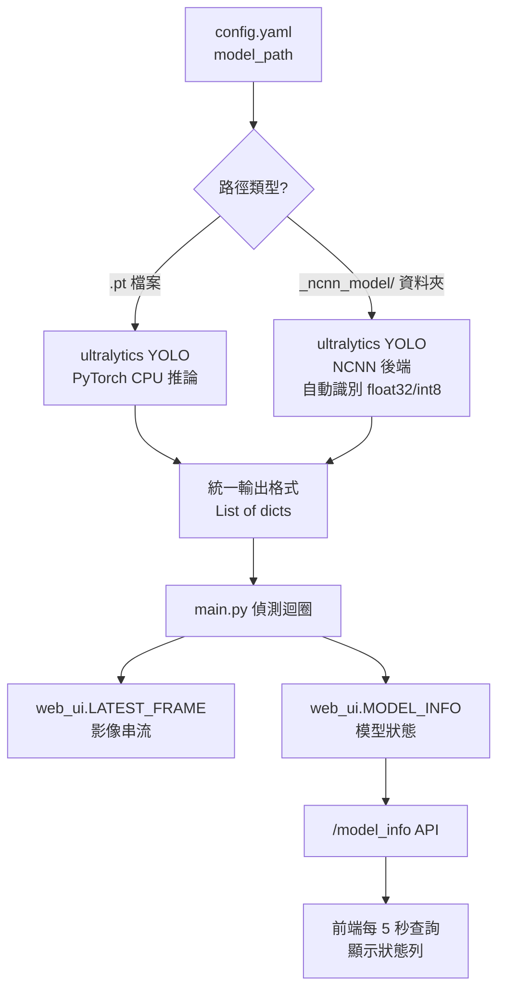

# 新增 NCNN 模型支援計劃（最終版）

## 目標說明

新增對 **NCNN 格式**模型（`_ncnn_model/` 資料夾）的支援，同時相容 float32 與 int8 量化版本。
利用 `ultralytics` 對 NCNN 的內建包裝，最小化改動範圍，保持對外介面不變。

---

## 確認後的設計決策

| 問題 | 決策 |
|------|------|
| 後端偵測方式 | `model_path` 為**資料夾** → NCNN；`.pt` 檔案 → PyTorch（行為不變） |
| 推論層實作 | **直接用 `ultralytics YOLO('best_ncnn_model').predict()`**，不自寫 NMS 與前後處理 |
| config.yaml 新欄位 | **不新增**，`num_threads` 沿用現有 `cpu_cores`，`input_size` 不需要 |
| 類別架構 | **簡化**：`InferenceEngine` 直接用 `YOLO()` 載入，判斷路徑類型即可 |
| `export_ncnn.py` | **不納入**，使用者自行處理模型轉換 |
| `requirements.txt` | **新增 `ncnn`** 套件 |
| Web UI | 新增 **`/model_info` API 端點**，前端定期查詢並顯示格式/路徑/cpu_cores |

---

## 擬修改的檔案

---

### 核心推論引擎

#### [MODIFY] inference_engine.py

大幅簡化：`InferenceEngine` 直接用 `YOLO()` 載入（ultralytics 自動支援 NCNN 資料夾），
移除所有自寫的前後處理與 NMS，新增 `model_type` 屬性供 `/model_info` 回傳。

```diff
-from ultralytics import YOLO
-import time
-
-class InferenceEngine:
-    def __init__(self, model_path="yolov8n.pt"):
-        self.model = YOLO(model_path)
-        
-    def infer(self, frame, conf_threshold=0.25):
-        start_time = time.time()
-        results = self.model.predict(frame, device='cpu', verbose=False, conf=conf_threshold)
-        end_time = time.time()
-        ...
+import os
+import time
+from ultralytics import YOLO
+
+class InferenceEngine:
+    """
+    統一推論引擎，根據 model_path 自動選擇後端：
+    - .pt 結尾  → ultralytics PyTorch 後端
+    - 資料夾    → ultralytics NCNN 後端（支援 float32 / int8）
+    """
+
+    def __init__(self, model_path="yolov8n.pt", num_threads=4):
+        self.model_path = model_path
+        self.num_threads = num_threads
+
+        # 判斷後端類型（供 /model_info 使用）
+        if os.path.isdir(model_path):
+            self.model_type = "NCNN"
+        else:
+            self.model_type = "PyTorch"
+
+        self.model = YOLO(model_path)
+
+    def infer(self, frame, conf_threshold=0.25):
+        start_time = time.time()
+        results = self.model.predict(
+            frame,
+            device='cpu',
+            verbose=False,
+            conf=conf_threshold
+        )
+        inference_time = (time.time() - start_time) * 1000  # ms
+
+        detections = []
+        for r in results:
+            for box in r.boxes:
+                detections.append({
+                    "cls":  int(box.cls),
+                    "conf": float(box.conf),
+                    "xyxy": box.xyxy.tolist()
+                })
+        return detections, inference_time
```

> [!NOTE]
> `num_threads` 參數目前保留在 constructor 中，但 ultralytics 包裝的 NCNN
> 需要在模型載入前透過環境變數 `NCNN_THREADS` 或未來 ultralytics API 設定。
> 若後續需要明確控制，可在此擴充。

---

### 設定檔

#### [MODIFY] config.yaml

**不新增欄位**，`cpu_cores` 欄位的值將被傳入 `InferenceEngine` 作為 `num_threads` 使用。

```yaml
# 無需更改，model_path 指向資料夾即切換至 NCNN
model_path: best_ncnn_model   # ← 切換至 NCNN（或保留 best.pt 使用 PyTorch）
cpu_cores: 4                  # 同時作為 NCNN num_threads 使用
```

---

### 主程式

#### [MODIFY] main.py

修改 `InferenceEngine` 初始化，傳入 `num_threads=cpu_cores`：

```diff
-    engine = InferenceEngine(model_path=config.get("model_path", "yolov8n.pt"))
+    engine = InferenceEngine(
+        model_path=config.get("model_path", "yolov8n.pt"),
+        num_threads=config.get("cpu_cores", 4)
+    )
```

熱重載時同步更新：

```diff
-                if new_config.get("model_path") != config.get("model_path"):
-                    engine = InferenceEngine(model_path=new_config.get("model_path", "yolov8n.pt"))
+                model_changed = new_config.get("model_path") != config.get("model_path")
+                cores_changed = new_config.get("cpu_cores") != config.get("cpu_cores")
+                if model_changed or cores_changed:
+                    engine = InferenceEngine(
+                        model_path=new_config.get("model_path", "yolov8n.pt"),
+                        num_threads=new_config.get("cpu_cores", 4)
+                    )
```

同時，`engine` 需要對 `web_ui` 模組可見，才能讓 `/model_info` 讀取狀態。
透過 `web_ui` 模組的共享全域變數（仿照 `LATEST_FRAME` 的模式）：

```diff
+# 在啟動 engine 後，將資訊同步至 web_ui
+web_ui.MODEL_INFO = {
+    "type": engine.model_type,
+    "path": engine.model_path,
+    "cpu_cores": config.get("cpu_cores", 4)
+}
```

---

### Web UI 後端

#### [MODIFY] web_ui.py

新增 `MODEL_INFO` 全域變數與 `/model_info` API 端點：

```diff
 LATEST_FRAME = None
+MODEL_INFO = {
+    "type": "Unknown",
+    "path": "",
+    "cpu_cores": 4
+}

+@app.route('/model_info')
+def model_info():
+    from flask import jsonify
+    return jsonify(MODEL_INFO)
```

---

### Web UI 前端

#### [MODIFY] templates/index.html

在 `sys-header` 下方新增模型資訊狀態列，定期透過 `/model_info` 更新：

```html
<!-- 新增於 <header> 之後 -->
<div class="model-status-bar" id="model-status-bar">
    <span class="status-label">MODEL_BACKEND</span>
    <span class="status-value" id="model-type">---</span>
    <span class="status-sep">//</span>
    <span class="status-label">PATH</span>
    <span class="status-value" id="model-path">---</span>
    <span class="status-sep">//</span>
    <span class="status-label">CPU_CORES</span>
    <span class="status-value" id="model-cores">---</span>
</div>

<script>
function refreshModelInfo() {
    fetch('/model_info')
        .then(r => r.json())
        .then(data => {
            document.getElementById('model-type').textContent = data.type;
            document.getElementById('model-path').textContent = data.path;
            document.getElementById('model-cores').textContent = data.cpu_cores;
        });
}
refreshModelInfo();
setInterval(refreshModelInfo, 5000); // 每 5 秒更新
</script>
```

樣式（新增至 `<style>` 區塊）：

```css
.model-status-bar {
    display: flex;
    align-items: center;
    gap: 0.8rem;
    padding: 0.5rem 1rem;
    border: 1px solid var(--border);
    background: var(--panel);
    font-size: 0.75rem;
    margin-bottom: 2rem;
    flex-wrap: wrap;
}
.status-label { color: var(--text-dim); }
.status-value { color: var(--text); font-weight: bold; }
.status-sep   { color: var(--border); }
```

---

### 相依套件

#### [MODIFY] requirements.txt

新增 `ncnn`，移除重複的 `pyyaml`：

```diff
 opencv-python-headless
 ultralytics
 pyyaml
 psutil
 flask
-pyyaml
+ncnn
```

---

## 資料流圖



---

## 驗證計劃

### 環境準備

```powershell
# 安裝新增套件
pip install ncnn
```

### 功能驗證

1. **PyTorch 後端（迴歸測試）**
   - `model_path: best.pt` → 確認推論正常，`/model_info` 回傳 `"type": "PyTorch"`

2. **NCNN 後端切換**
   - 在 RPi 5 上執行 `yolo export model=best.pt format=ncnn`
   - 修改 `model_path: best_ncnn_model` → 重啟應用
   - 確認 `/model_info` 回傳 `"type": "NCNN"`
   - 確認 Web UI 狀態列正確顯示

3. **熱重載測試**
   - 應用執行中，修改 `model_path` 切換 PT ↔ NCNN → 確認自動重載

4. **效能對比**
   - 比較 `performance.log` 中 PT 與 NCNN 的平均推論時間

### 預期效能改善（RPi 5 ARM64 估算）

| 後端 | 推論時間 | 相對改善 |
|------|---------| --------|
| PyTorch `.pt` | ~350ms | baseline |
| NCNN float32 | ~100ms | **~3.5x** |
| NCNN int8 | ~50ms | **~7x** |
