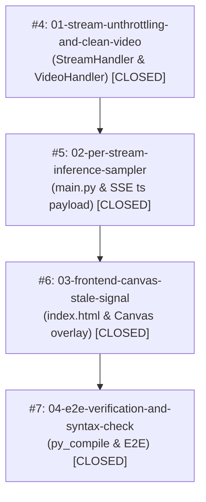

# 串流 FPS 與推檢解耦及動態 Canvas 畫框 Ticket 清單 (已全數完成)

**專案**: Argus Safety Predictor Nano  
**參考 Spec 文件**: [fps_decoupling_and_dynamic_canvas_overlay_prd.md](file:///D:/Projects/argus/safty-predictor-nano/docs/prd/fps_decoupling_and_dynamic_canvas_overlay_prd.md)  
**參考 ADR 文件**: [ADR-012](file:///D:/Projects/argus/safty-predictor-nano/docs/adr/ADR-012-decoupled-stream-fps-and-inference-sampling.md)  
**Gitea Issue Tracker**: `http://tncimweb.cminl.oa/git-server/guy.mai/safty-predictor-nano/issues`

---

## Ticket 依賴關係圖

---

## Gitea Issues 清單與對應項目

1. **[Gitea #4] 01: 解耦影像解碼串流與去除 Python 伺服器繪框**
   - 狀態：`CLOSED`
   - 被阻擋：無 (Blocked by: None)
   - 內容：修改 `StreamHandler` 與 `VideoHandler` 移除 sleep (1.0/fps_limit)，維持 30 FPS 高流暢度；移除 Python 端方框標注；影片倒帶時清空 `LATEST_DETECTIONS`。

2. **[Gitea #5] 02: 每路獨立推論抽樣器與 Timestamp 傳遞**
   - 狀態：`CLOSED`
   - 被阻擋：#4
   - 內容：`_inference_worker` 依 `fps_limit` 進行時間點抽檢推論；將 Unix timestamp `ts` 帶入 SSE `/detections_feed` payload。

3. **[Gitea #6] 03: 前端動態 Canvas 畫框與過時抽樣 UI 提示**
   - 狀態：`CLOSED`
   - 被阻擋：#5
   - 內容：`index.html` 在 Modal 單路視窗訂閱 SSE 動態畫框；當 `ts` 距今大於 0.15 秒時轉換為虛線框 (`setLineDash([4, 4])`) 與 `[SAMPLED]` 標籤。

4. **[Gitea #7] 04: 端對端整合驗證與測試**
   - 狀態：`CLOSED`
   - 被阻擋：#6
   - 內容：執行 `py_compile` 語法測試與端對端驗證。
