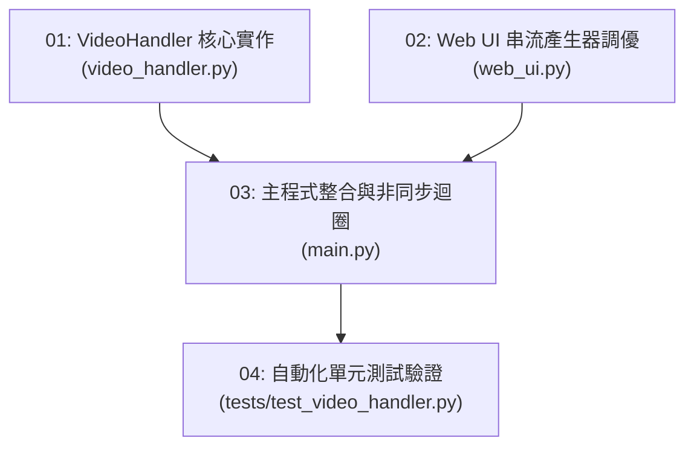

# 本地影片 1.0x 原速播放 Ticket Task 拆解清單

**專案**: Argus Safety Predictor Nano  
**參考 Spec 文件**: [native_speed_video_playback_prd.md](file:///D:/Projects/argus/safty-predictor-nano/docs/prd/native_speed_video_playback_prd.md)

---

## Ticket 依賴關係圖

---

## Ticket 明細與追蹤檔案

1. [`01-video-handler-core.md`](file:///D:/Projects/argus/safty-predictor-nano/.scratch/native-speed-video/issues/01-video-handler-core.md) — 已完成
2. [`02-web-ui-stream-tuning.md`](file:///D:/Projects/argus/safty-predictor-nano/.scratch/native-speed-video/issues/02-web-ui-stream-tuning.md) — 已完成
3. [`03-main-orchestration-integration.md`](file:///D:/Projects/argus/safty-predictor-nano/.scratch/native-speed-video/issues/03-main-orchestration-integration.md) — 已完成
4. [`04-unit-tests-and-verification.md`](file:///D:/Projects/argus/safty-predictor-nano/.scratch/native-speed-video/issues/04-unit-tests-and-verification.md) — 已完成
