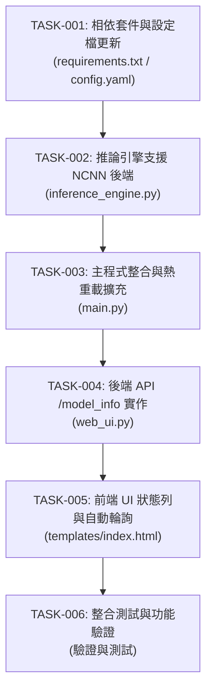

# NCNN 支援功能任務拆解與 Ticket 列表

**專案**: Argus Safety Predictor Nano  
**參考文件**: 
- PRD: [ncnn_support_prd.md](file:///D:/Projects/argus/safty-predictor-nano/docs/prd/ncnn_support_prd.md)
- Planning: [ncnn_support_plan.md](file:///D:/Projects/argus/safty-predictor-nano/docs/planning/ncnn_support_plan.md)

---

## 任務概覽與依賴關係

---

## Ticket 詳細內容

### [TASK-001] 相依套件與設定檔更新
- **複雜度**: Easy (S)
- **類型**: Chore / Config
- **對應 User Story**: User Story 12
- **目標檔案**:
  - [`requirements.txt`](file:///D:/Projects/argus/safty-predictor-nano/requirements.txt)
  - [`config.yaml`](file:///D:/Projects/argus/safty-predictor-nano/config.yaml)
- **描述**:
  1. 在 `requirements.txt` 中新增 `ncnn` 套件，並清理重複出現的 `pyyaml` 項目。
  2. 在 `config.yaml` 中補強註解說明，註明 `model_path` 可設定為 `.pt` 檔案或 NCNN 模型資料夾，且 `cpu_cores` 將會同步傳入推論引擎作為執行緒數。
- **驗證條件**:
  - `pip install -r requirements.txt` 成功安裝 `ncnn` 無衝突。

---

### [TASK-002] 核心推論引擎重構支援 NCNN
- **複雜度**: Medium (M)
- **類型**: Feature / Core Inference
- **對應 User Story**: User Story 2, 3, 4, 5, 6
- **目標檔案**:
  - [`inference_engine.py`](file:///D:/Projects/argus/safty-predictor-nano/inference_engine.py)
- **描述**:
  1. 修改 `InferenceEngine.__init__()` 接受 `num_threads` 參數。
  2. 依據 `os.path.isdir(model_path)` 自動判斷後端類型（`self.model_type = "NCNN"` 或 `"PyTorch"`）。
  3. 保留 `ultralytics YOLO()` 統一載入介面與 `infer()` 的 `List[dict]` 輸出結構，確保 `cls`、`conf`、`xyxy` 等欄位與 PyTorch 後端完全一致。
- **驗證條件**:
  - 載入 `.pt` 檔時 `engine.model_type` 為 `"PyTorch"`。
  - 載入資料夾時 `engine.model_type` 為 `"NCNN"`。
  - `infer(frame)` 正確回傳偵測物件列表與推論時間 (ms)。

---

### [TASK-003] 主控制程式整合與熱重載擴充
- **複雜度**: Medium (M)
- **類型**: Feature / Orchestration
- **對應 User Story**: User Story 6, 7, 9
- **目標檔案**:
  - [`main.py`](file:///D:/Projects/argus/safty-predictor-nano/main.py)
- **描述**:
  1. 初始化 `InferenceEngine` 時，將 `config.get("cpu_cores", 4)` 作為 `num_threads` 傳入。
  2. 在熱重載輪詢邏輯中，同時監控 `model_path` 與 `cpu_cores` 的異動，當任一變更時自動重建 `InferenceEngine`。
  3. 啟動與引擎重建時，將最新狀態寫入共享全域變數 `web_ui.MODEL_INFO`（包含 `type`、`path`、`cpu_cores`）。
- **驗證條件**:
  - 修改 `config.yaml` 中的 `model_path` 或 `cpu_cores` 時，系統能無縫重新載入模型與設定。
  - `web_ui.MODEL_INFO` 內容即時保持最新。

---

### [TASK-004] 後端 API `/model_info` 實作
- **複雜度**: Easy (S)
- **類型**: Feature / API
- **對應 User Story**: User Story 8, 9
- **目標檔案**:
  - [`web_ui.py`](file:///D:/Projects/argus/safty-predictor-nano/web_ui.py)
- **描述**:
  1. 定義 `MODEL_INFO` 全域字典（包含 `type`、`path`、`cpu_cores`）。
  2. 新增路由 `@app.route('/model_info')` 回傳 `MODEL_INFO` 的 JSON 格式。
- **驗證條件**:
  - GET `http://localhost:8188/model_info` 回傳 `200 OK` 並且含有 JSON 欄位 `{"type": "...", "path": "...", "cpu_cores": 4}`。

---

### [TASK-005] 前端 UI 狀態列與自動輪詢實作
- **複雜度**: Medium (M)
- **類型**: UI / Frontend
- **對應 User Story**: User Story 8, 9, 10
- **目標檔案**:
  - [`templates/index.html`](file:///D:/Projects/argus/safty-predictor-nano/templates/index.html)
- **描述**:
  1. 在 `<header>` 下方新增模型狀態列 HTML 結構 (`.model-status-bar`)。
  2. 新增對應 CSS 樣式，保持極簡黑底綠字終端風格。
  3. 新增 JavaScript 輪詢函式 `refreshModelInfo()`，每 5 秒 fetch `/model_info` 並更新 UI。
- **驗證條件**:
  - 網頁載入後狀態列正確顯示 `MODEL_BACKEND`、`PATH`、`CPU_CORES`。
  - 觸發熱重載後，5 秒內網頁狀態列自動反應最新設定。

---

### [TASK-006] 整合測試與手動功能驗證
- **複雜度**: Medium (M)
- **類型**: QA / Verification
- **對應 User Story**: User Story 1, 11
- **目標檔案**: N/A (執行環境與驗證)
- **描述**:
  1. 迴歸測試：確認 PyTorch `.pt` 模型推論運作正常。
  2. NCNN 測試：確認 NCNN 模型（資料夾格式）載入與推論正常。
  3. 熱重載測試：執行期間切換 PyTorch ↔ NCNN，確認動態切換無崩潰。
  4. 效能日誌比對：確認 `performance.log` 中的推論延遲數據符合預期。
- **驗證條件**:
  - 4 項驗證情境皆順利通過，推論日誌無 Exception。
