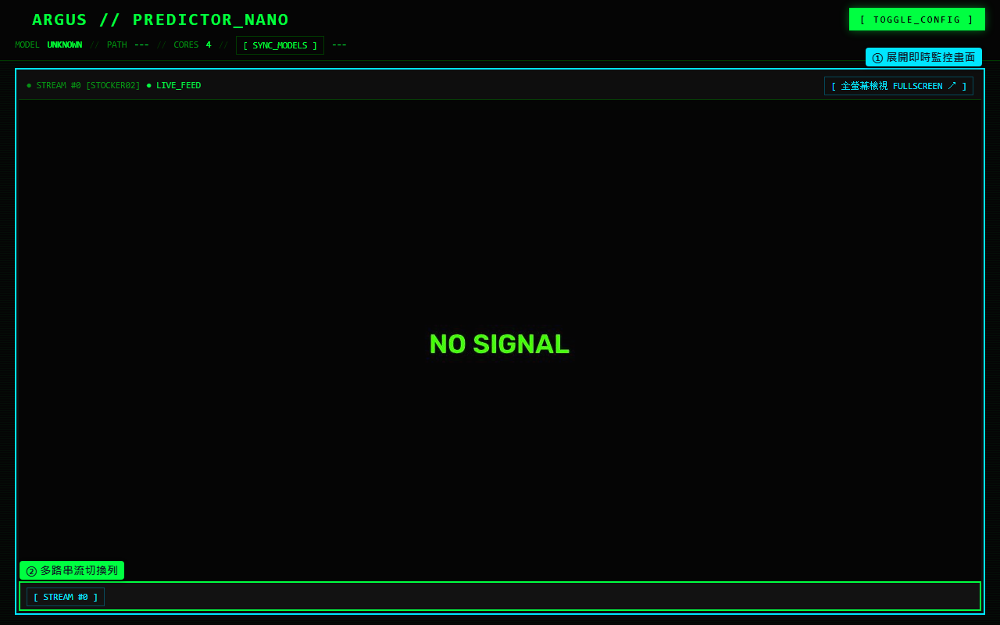

# 第 1 章：介面導覽與基礎操作

本章介紹 Argus Safety Predictor Nano Web 管理介面的版面配置、狀態列資訊判讀，以及純監控檢視模式的切換操作。

---

## 介面總覽

進入系統首頁後，整體介面採用終端高對比深色風格，主要由頂部狀態列、左側系統設定面板，以及右側即時影像與屬性檢視區構成。

| 標號 | 區塊名稱 | 功能說明 |
|:---:|---|---|
| **①** | **頂部系統狀態列** | 顯示系統運作標題、當前全域模型類別、路徑、CPU 核心數、雲端模型同步狀態按鈕 `「SYNC_MODELS」`，以及設定面板開關按鈕 `「TOGGLE_CONFIG」`。 |
| **②** | **系統設定參數面板** | 提供推論效能、模型來源（本地/UMS）、運作模式（RTSP/影片）及進階網路代理參數的設定表單。 |
| **③** | **即時預覽視窗** | 呈現當前選定串流的低延遲即時推論影像，支援一鍵進入全螢幕檢視與監控模式切換。 |
| **④** | **串流詳細屬性檢視器** | 檢視與調整當前選中串流的 URL、標籤、鏡頭 ID、獨立覆蓋模型（Override Model）與實際生效模型（Resolved Model）。 |

---

## 操作步驟

### 1. 判讀頂部系統狀態列

頂部狀態列會每 5 秒自動更新目前核心推論引擎的運作狀態：

- **MODEL**：顯示當前推論引擎的格式核心（如 `ONNX`、`PyTorch`、`NCNN` 等）。
- **PATH**：當前載入的模型檔案檔名或路徑。
- **CORES**：系統配置給推論引擎的 CPU 執行緒核心數。
- **`「SYNC_MODELS」`**：點擊可手動向 UMS 雲端發起模型檢查與快取同步，按鈕右側會顯示同步結果（例：`OK:1 FAIL:0`）。
- **`「TOGGLE_CONFIG」`**：切換左側設定面板的顯示或收合。

---

### 2. 切換純監控檢視模式

當現場人員不需要修改系統設定，只需專注於即時畫面監看時，可一鍵切換為純監控模式：

1. 點擊右上角 `「TOGGLE_CONFIG」` 按鈕。
2. 左側設定面板將會自動收合，右側即時影像視窗將自動放大至全寬度。
3. 影像下方會顯示多路串流切換快捷列（如 `「STREAM #0」`、`「STREAM #1」`），點擊按鈕即可快速切換不同攝影機畫面。

4. 若需返回設定介面，再次點擊右上角 `「TOGGLE_CONFIG」` 按鈕即可展開左側設定面板。

---

## 注意事項

- 系統採用非同步低延遲串流架構，預覽畫面為單幀覆寫機制，在網路頻寬較低時會自動保持即時性，不累積延遲。
- 若切換串流後畫面短暫出現 `NO SIGNAL` 綠色字樣，代表系統正在與該攝影機建立 RTSP 握手連線，連線成功後將自動播放畫面。
