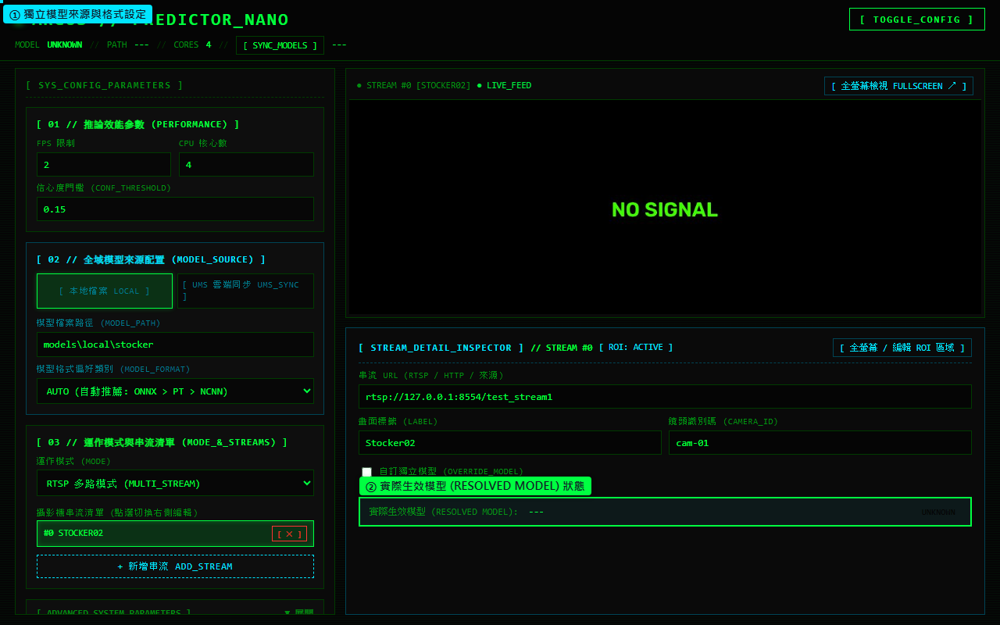

# 第 3 章：AI 模型配置與 UMS 雲端同步

本章介紹如何在 Argus Safety Predictor Nano 中配置 AI 目標偵測模型來源（本地檔案或 UMS 雲端同步）、設定推論格式偏好，以及為各路攝影機設定獨立模型覆蓋（Override Model）。

---

## 介面總覽

模型配置分為左側「02 // 全域模型來源配置」與右側「串流詳細屬性檢視器」中的獨立模型設定。

| 標號 | 元素名稱 | 說明 |
|:---:|---|---|
| **①** | **模型來源切換 (MODEL_SOURCE)** | 提供 `「[ 本地檔案 LOCAL ]」` 與 `「[ UMS 雲端同步 UMS_SYNC ]」` 兩種來源模式。 |
| **②** | **本地模型路徑 (MODEL_PATH)** | 在本地模式下，輸入存放於本機或模型目錄中的權重檔案路徑（如 `best.onnx`、`best.pt` 或 NCNN 資料夾）。 |
| **③** | **模型格式偏好類別 (MODEL_FORMAT)** | 設定格式推薦優先級別，提供 `AUTO (自動推薦: ONNX > PT > NCNN)`、`ONNX`、`PyTorch` 與 `NCNN`。 |

---

## 操作步驟

### 1. 配置全域本地模型 (LOCAL)

1. 在左側「02 // 全域模型來源配置」中點選 `「[ 本地檔案 LOCAL ]」`。
2. 於「模型檔案路徑」欄位輸入模型檔案名稱（例：`best.onnx`）或完整路徑。
3. 選擇「模型格式偏好類別」為 `「AUTO」` 或指定格式。
4. 點擊 `「[ EXECUTE_UPDATE ]」` 儲存，推論引擎將自動載入指定模型。

---

### 2. 配置 UMS 雲端同步模型 (UMS_SYNC)

若已於進階設定中填妥 UMS API 連線資訊，可直接從雲端選取並同步模型：

1. 點選 `「[ UMS 雲端同步 UMS_SYNC ]」`。
2. 系統會自動透過 UMS API 抓取可用專案，於「UMS 專案 (PROJECT)」下拉選單中選擇專案名稱。
3. 於「UMS 模型 (MODEL)」下拉選單選擇欲部屬的模型。
4. 於「模型版本 (VERSION)」選擇指定版本（預設 `latest` 為最新 Active 版本）。
5. 點擊 `「[ EXECUTE_UPDATE ]」`，系統將在背景自動下載並快取該雲端模型。

---

### 3. 設定單一串流獨立模型覆蓋 (OVERRIDE_MODEL)

當特定攝影機需要執行不同目標偵測任務（例如：大門入口偵測人員、產線區域偵測工件）時，可為該串流指定獨立模型：

1. 於左側串流清單選取目標攝影機（如 `[ STREAM #1 ]`）。
2. 在右側檢視器中勾選 `「自訂獨立模型 (OVERRIDE_MODEL)」`。
3. 展開獨立模型設定區，選擇獨立來源為 `「[ 本地檔案 LOCAL ]」` 或 `「[ UMS 雲端同步 UMS_SYNC ]」`，並指定模型路徑或 UMS 專案模型版本。
4. 下方「實際生效模型 (RESOLVED MODEL)」會立即顯示當前串流最終生效的模型路徑與格式標籤（例：`custom_model.onnx` / `ONNX`）。
5. 點擊 `「[ EXECUTE_UPDATE ]」` 儲存並套用。

---

### 4. 手動觸發雲端模型同步

頂部系統狀態列提供即時狀態監控與手動同步功能：

1. **查看全域模型狀態**：頂部狀態列顯示目前推論引擎的核心格式（`MODEL`）、載入路徑（`PATH`）與核心數（`CORES`）。
2. **手動檢查更新**：點擊頂部狀態列中的 `「[ SYNC_MODELS ]」` 按鈕。
3. 系統將即時向 UMS 雲端比對所有配置了 UMS 同步的串流模型，並於按鈕右側顯示同步結果（例：`OK:1 FAIL:0`）。

---

## 注意事項

- **格式優先級 (AUTO)**：在 ARM64 / 樹莓派 5 架構下，系統強烈推薦維持 `AUTO` 設定，系統會自動優先採用 ONNX Runtime 推論以達到最佳效能；若 ONNX 檔案不存在則依序降級為 PyTorch 或 NCNN。
- **快取機制**：UMS 雲端同步之模型檔案會自動下載並持久化儲存於 `models/` 目錄中，離線或斷網環境下重啟系統仍可正常使用已快取的模型。
