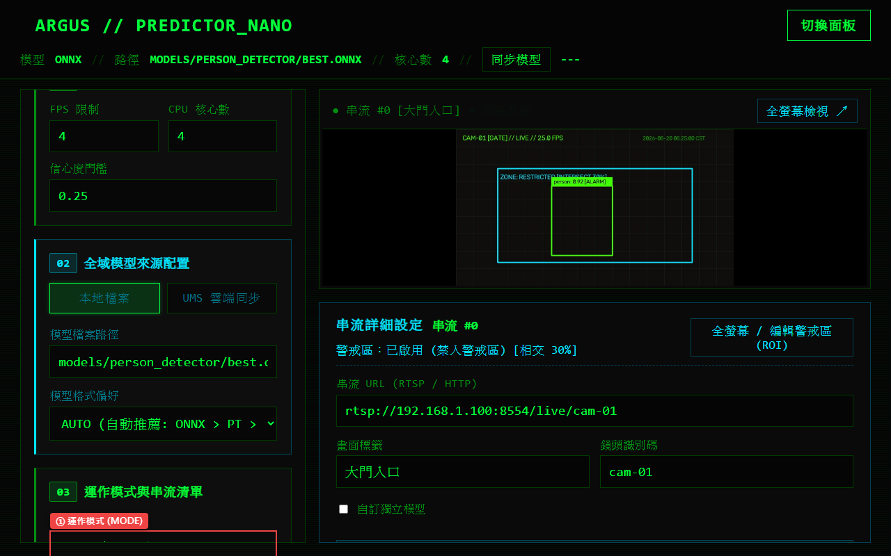
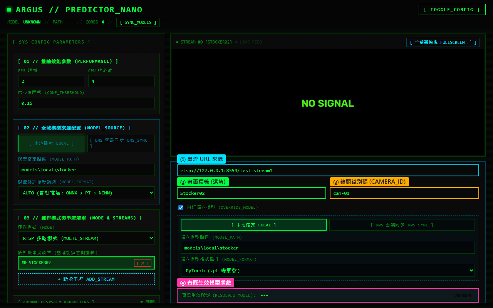
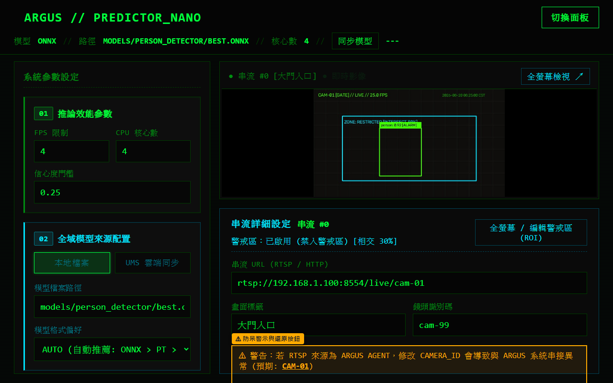

# 第 3 章：串流與影像來源管理

本章說明如何在 Argus Safety Predictor Nano 系統中配置與管理 RTSP 攝影機多路串流，設定畫面標籤、鏡頭識別碼（Camera ID），以及切換至離線影片驗證模式。

---

## 介面總覽

串流管理由左側「03 // 運作模式與串流清單」與右下方「串流詳細屬性檢視器 (STREAM_DETAIL_INSPECTOR)」共同協作。

| 標號 | 元素名稱 | 說明 |
|:---:|---|---|
| **①** | **運作模式 (MODE)** | 下拉選單提供「RTSP 多路模式 (MULTI_STREAM)」與「影片驗證模式 (VIDEO_FILE)」切換。 |
| **②** | **攝影機串流清單** | 條列目前配置的所有攝影機串流，點選項目可切換右側即時預覽與詳細屬性檢視；右側提供 `「✕」` 按鈕可刪除串流。 |
| **③** | **新增串流按鈕** | 點擊 `「+ 新增串流 ADD_STREAM」` 可在清單尾端新增一路空白串流。 |

---

## 操作步驟

### 1. 新增與選取 RTSP 串流

1. 確認「運作模式」設定為 `「RTSP 多路模式 (MULTI_STREAM)」`。
2. 點擊 `「+ 新增串流 ADD_STREAM」` 按鈕，串流清單將新增一個 `[ STREAM #N ]` 項目。
3. 點選該串流項目，右側「串流詳細屬性檢視器」將自動切換為該串流的編輯狀態。

---

### 2. 編輯串流詳細屬性

在右側「串流詳細屬性檢視器」中填寫以下欄位：

1. **串流 URL (RTSP / HTTP / 來源)**：輸入攝影機的 RTSP 串流網址（例：`rtsp://192.168.1.100:8554/live/cam-01`）。
2. **畫面標籤 (LABEL)**：輸入便於人員辨識的鏡頭中文名稱（例：`大門入口`、`A區產線`），此標籤將顯示於預覽標題。
3. **鏡頭識別碼 (CAMERA_ID)**：系統事件回報與 Argus 平台對接時使用的識別碼（例：`cam-01`）。
4. 點擊左下角 `「[ EXECUTE_UPDATE ]」` 儲存並套用設定。

---

### 3. Argus Agent 鏡頭識別碼防呆機制

若 RTSP 來源來自 Argus Agent 串流伺服器（URL 路徑中包含 `cam-xx` 標籤），系統會自動解析並預設帶入對應的 `camera_id`：

- **防呆警示**：若手動修改此欄位使其與 URL 中的鏡頭 ID 不一致，系統會以黃色醒目標示並顯示警告：`⚠ 警告：若 RTSP 來源為 Argus Agent，修改 camera_id 會導致與 Argus 系統串接異常`。
- **一鍵還原**：點擊警告右側的 `「[ 還原為預設 ID ]」` 按鈕，即可立即將 `camera_id` 還原為 URL 解析出的標準鏡頭 ID。

---

### 4. 切換為影片驗證模式 (VIDEO_FILE)

若需要針對既有的錄影檔案進行模型推論與效果驗證，可切換為影片模式：

1. 在「運作模式 (MODE)」下拉選單中選擇 `「影片驗證模式 (VIDEO_FILE)」`。
2. 串流清單將會切換為「影片檔案路徑 (VIDEO_PATH)」輸入欄位。
3. 輸入本機或裝置上的影片絕對路徑（例：`D:\dataset\test_video.mp4` 或 `/home/pi/test.avi`）。
4. 點擊 `「[ EXECUTE_UPDATE ]」`，系統將開始針對指定影片進行逐幀推論。

---

## 注意事項

- 修改串流 URL 或新增串流後，務必點擊左側面板底部的 `「[ EXECUTE_UPDATE ]」` 按鈕，系統將自動重載串流處理程序。
- 至少需保留一路有效串流或指定正確的影片路徑，以確保即時推論模組正常運作。
- 刪除串流時，點擊串流清單右側的 `「✕」` 按鈕即可移除，確認移除後亦需點擊 `「[ EXECUTE_UPDATE ]」` 儲存配置。
