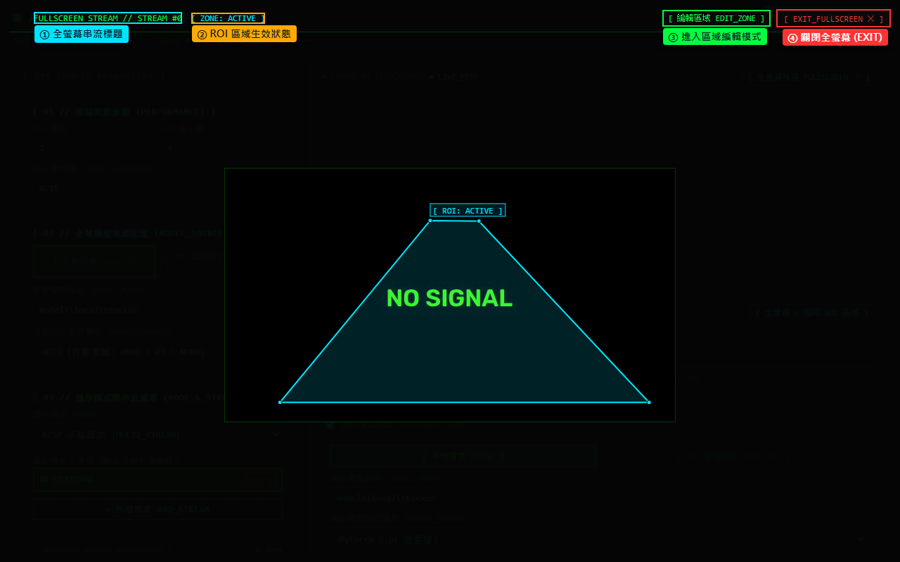
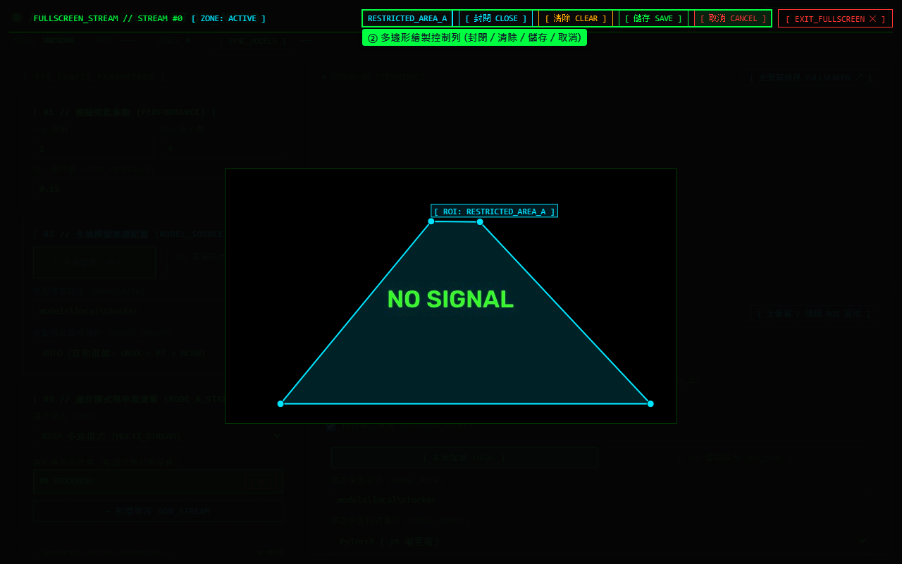

# 第 4 章：ROI 偵測區域編輯與全螢幕即時監控

本章介紹如何在 Argus Safety Predictor Nano 中開啟全螢幕高解析度即時串流監控，並利用視覺化多邊形繪製工具為每路攝影機自訂專屬的 ROI（Region of Interest，感興趣/警戒區域）。

---

## 介面總覽

點擊即時影像預覽區或右上方 `「[ 全螢幕檢視 FULLSCREEN ↗ ]」` 按鈕，即可開啟全螢幕監控視窗。

| 標號 | 元素名稱 | 說明 |
|:---:|---|---|
| **①** | **全螢幕串流標題** | 顯示當前檢視之串流編號與攝影機標籤（例：`FULLSCREEN_STREAM // STREAM #0`）。 |
| **②** | **ROI 區域生效狀態** | 顯示當前串流之 ROI 配置狀態；未劃定時為 `[ ZONE: INACTIVE ]`，已啟用為 `[ ZONE: ACTIVE: 區域名稱 ]`。 |
| **③** | **進入區域編輯模式** | 點擊 `「[ 編輯區域 EDIT_ZONE ]」` 進入視覺化多邊形劃定模式。 |
| **④** | **關閉全螢幕 (EXIT)** | 點擊 `「[ EXIT_FULLSCREEN ✕ ]」` 或按鍵盤 `ESC` / 點擊半透明背景返回主控制介面。 |

---

## 操作步驟

### 1. 開啟全螢幕即時影像與即時推論標註

1. 在主畫面點選欲檢視的攝影機串流。
2. 點擊右上角 `「[ 全螢幕檢視 FULLSCREEN ↗ ]」` 或直接點擊預覽畫面。
3. 全螢幕視窗將以高幀率呈現即時影像，系統並透過 SSE（Server-Sent Events）即時於影像上方疊加目標邊界框、類別標籤與信心度數據。

---

### 2. 繪製並儲存多邊形 ROI 警戒區域

當需要限定特定危險區域（如產線夾捲區、管制門禁通道）進行告警時，可依循以下步驟繪製多邊形區域：

1. 在全螢幕頂部點擊 `「[ 編輯區域 EDIT_ZONE ]」`。
2. 頂部控制列將切換為繪製工具：
   * **ZONE_NAME 輸入框**：輸入警戒區域名稱（例：`RESTRICTED_ZONE_1` 或 `禁入區`）。
3. **滑鼠點擊畫面建立頂點**：
   * 在畫面目標區域邊界上依序點擊滑鼠左鍵，建立多邊形的各個頂點（系統會自動以青色線條連接頂點）。
4. **控制按鈕操作**：
   * **`「[ 封閉 CLOSE ]」`**：自動將最後一個頂點與第一個頂點相連，形成封閉多邊形。
   * **`「[ 清除 CLEAR ]」`**：清除畫布上目前所有已點選的頂點，重新開始繪製。
   * **`「[ 儲存 SAVE ]」`**：完成繪製後點擊此按鈕，系統將多邊形座標與名稱透過 `/zone/<stream_url>` API 自動持久化儲存。
   * **`「[ 取消 CANCEL ]」`**：放棄當前修改，恢復原本已儲存的區域設定並退出編輯模式。

---

### 3. 確認 ROI 區域生效狀態

- 儲存完成後，全螢幕頂部狀態標籤將立即更新為青色 `[ ZONE: ACTIVE: 區域名稱 ]`。
- 回到主介面時，右側「串流詳細屬性檢視器」的狀態指示亦會同步顯示 `[ ROI: ACTIVE: 區域名稱 ]`。
- 後續 AI 推論引擎在產生事件日誌時，將自動比對偵測框中心點是否落於此多邊形範圍內，觸發精準區域告警。

---

## 注意事項

- **多邊形頂點限制**：多邊形至少需包含 3 個頂點才能成功封閉與儲存。
- **座標比例自我調適**：ROI 座標在儲存時會自動正規化為 `0.0 ~ 1.0` 的相對比例，即使攝影機解析度變更或視窗縮放，警戒區域皆能精準對齊。
- **獨立儲存生效**：ROI 區域儲存為獨立 API 端點，儲存後即刻生效，無需再點擊主面板的 `[ EXECUTE_UPDATE ]`。
