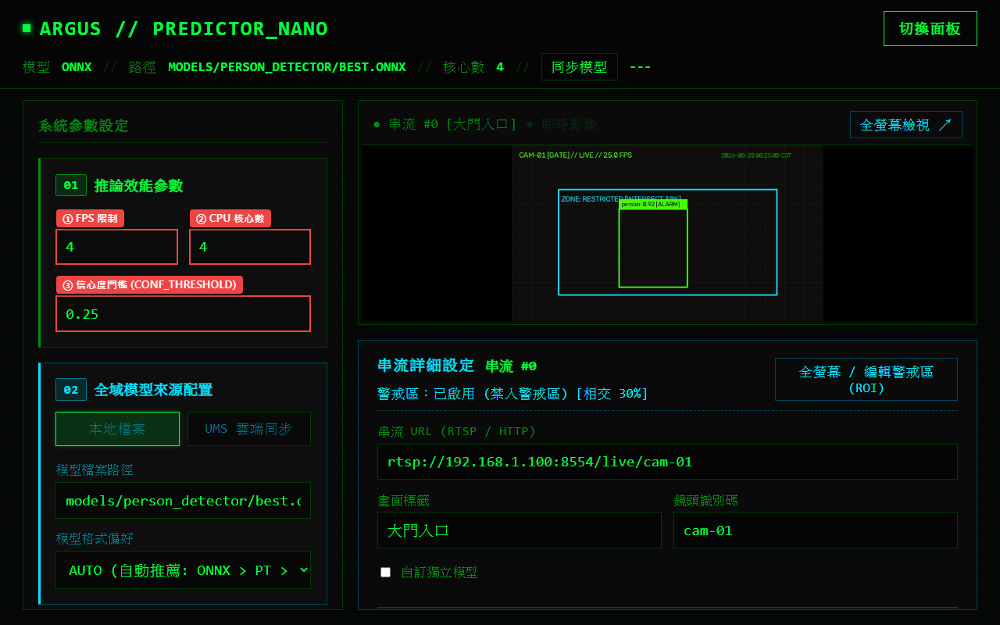
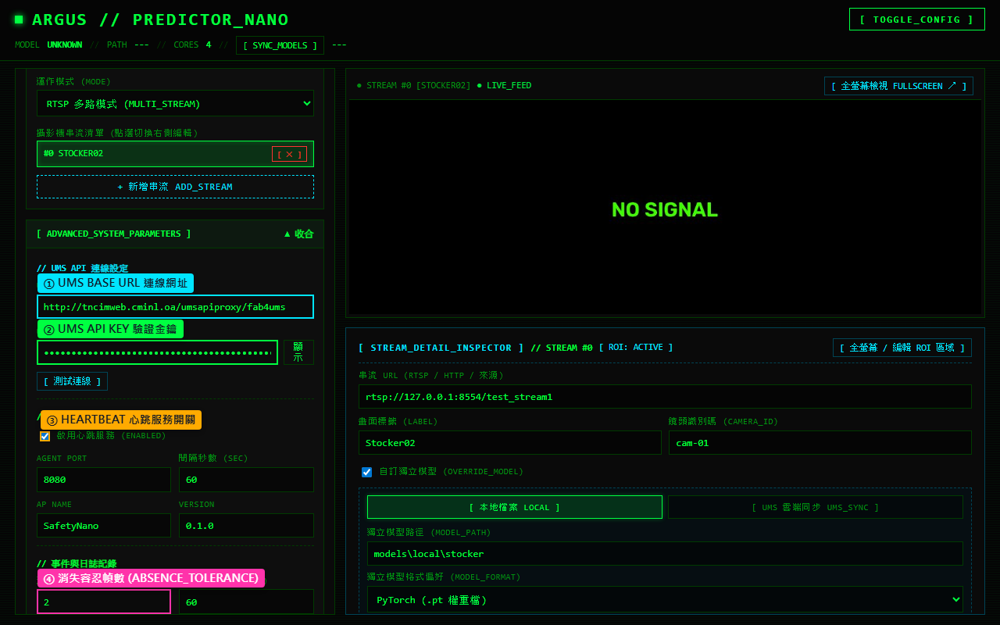

# 第 6 章：系統參數與進階設定

本章說明 Argus Safety Predictor Nano 的推論效能參數調校、UMS 平台 API 連線驗證、Heartbeat 心跳服務配置，以及系統日誌與事件容忍機制的設定步驟。

---

## 介面總覽

系統參數分為左側面板的「01 // 推論效能參數」以及可摺疊展開的「進階系統參數 (ADVANCED_SYSTEM_PARAMETERS)」。



| 標號 | 參數名稱 | 建議值 | 說明 |
|:---:|---|:---:|---|
| **①** | **FPS 限制** | `2` ~ `10` | 限制每路串流每秒最多進行推論的幀數，防止樹莓派 CPU 過載並維持低溫穩定。 |
| **②** | **CPU 核心數** | `4` | 指定 ONNX Runtime / PyTorch 推論時所使用的 CPU 執行緒數（樹莓派 5 預設建議 `4`）。 |
| **③** | **信心度門檻 (CONF_THRESHOLD)** | `0.25` ~ `0.5` | 目標偵測置信度過濾門檻（`0.01` ~ `1.0`），高於此門檻之物件才會被標記為有效偵測。 |

---

## 進階系統參數

點擊 `「[ ADVANCED_SYSTEM_PARAMETERS ]」` 標題可展開進階設定區塊：



| 標號 | 參數區塊 | 說明 |
|:---:|---|---|
| **①** | **UMS 服務端點與備援清單 (UMS_BASE_URLS)** | 支援配置多組 UMS API 代理伺服器端點（主備端點），提供「廠區預設快速選單 (FAB PRESETS)」自動帶入各廠區 `src1` 與 `src2`。 |
| **②** | **UMS API KEY** | 用於向 UMS 平台進行身份驗證的金鑰；可點擊右側 `「顯示」` 按鈕切換明文或密碼模式。 |
| **③** | **HEARTBEAT 服務** | 勾選 `「啟用心跳服務 (ENABLED)」` 啟用定時健康檢查回報代理；支援自訂 `AGENT PORT`、`間隔秒數`、`AP NAME` 與 `VERSION`。 |
| **④** | **消失容忍幀數** | 當目標在連續畫面中暫時遮擋或消失時，允許維持事件狀態的容忍幀數（預設建議 `2` ~ `5` 幀），避免事件反覆斷開觸發。 |

---

## 操作步驟

### 1. 調校邊緣端推論效能

1. 根據現場攝影機路數與硬體負載調整「FPS 限制」（例如：4 路攝影機時建議設定為 `2` ~ `4` FPS）。
2. 在「CPU 核心數」填入合適數值（Raspberry Pi 5 為 4 核心，建議填 `4`）。
3. 根據環境光線與誤報情況調整「信心度門檻」。

---

### 2. 設定 UMS API 多端點備援與驗證連線

Argus Safety Predictor Nano 內建**透明請求層級容錯切換 (Failover)** 機制：

1. 展開 `「[ ADVANCED_SYSTEM_PARAMETERS ]」`。
2. **選取廠區預設**：於「廠區預設快速選單 (FAB PRESETS)」挑選所在廠區（例如 OA、FAB 1、FAB 3 等），系統將自動帶入該廠區對應之 `src1` 主要端點與 `src2` 備援端點。
3. **動態增刪端點**：若有特殊需求，可點擊 `「+ 新增備援端點」` 增加第三方代理或臨時端點，或點擊 `「✕」` 移除特定端點。
4. 輸入「UMS API KEY」。
5. 點擊 `「[ 測試連線 ]」` 按鈕。系統將同時/依序檢測所有配置的端點，並於各端點下方顯示獨立檢測狀態（如 `✓ 正常 (3 models)` 或 `✗ 異常: 連線逾時`）。
6. **容錯運作原理**：
   - 模型同步或清單查詢時，系統優先連線至主要端點。
   - 若遭遇網路逾時 (Timeout 5~10 秒) 或伺服器 5xx 錯誤，系統將自動無感嘗試下一組備援端點，並記錄警告日誌。
   - 備援端點連線成功後，系統會自動記憶 Active 端點，後續請求優先使用，確保邊緣推論服務不中斷。

---

### 3. 配置 Heartbeat 心跳代理、事件截圖與日誌留存

1. 確認勾選 `「啟用心跳服務 (ENABLED)」`。
2. 確認 `AGENT PORT`（預設 `8080`）與 `間隔秒數`（預設 `60` 秒）。
3. 於「事件與日誌記錄」區塊可自訂：
   * **消失容忍幀數**：設定目標抗遮擋的容忍幀數（預設 2 幀）。
   * **事件資料留存天數 (天)**：自訂事件日誌與事件截圖的保存天數（`event_retention_days`，預設 `30` 天，允許值 >= 1）。
   * **效能日誌間隔 (秒)**：設定寫入系統效能統計的間隔秒數。
   * **日誌保留天數 (天)**：預設為 `3` 天，系統每日午夜自動輪轉系統與效能日誌並清除超過保留天數的舊檔案。
   * **效能日誌檔名**：預設為 `logs/performance.log`，記錄 CPU/記憶體/推論耗時。
   * **偵測日誌檔名**：預設為 `logs/detections.log`，記錄各鏡頭觸發偵測之時間與物件類別。

---

### 4. 事件日誌規格、PTS 時間戳與非同步截圖機制

系統產生的事件日誌與擷取截圖符合 **ARGUS JSONL spec v0.0.1** 規格：

- **PTS 原生時間戳**：擷取影像訊框原生 Presentation Timestamp (PTS)，轉換為精確至毫秒之 ISO 8601 UTC 字串（如 `2026-08-29T07:36:04.404Z`），確保 AI 事件時序能精確對齊 NVR/VMS 錄影回放。若串流無有效 PTS 則自動 Fallback 至系統時間。
- **非同步事件單次截圖**：當目標初次觸發事件（`EventStart`）時，系統將未標註的原始乾淨訊框（Clean Frame）排入非同步背景佇列寫入硬碟，並於 `EventStart.meta.snapshot_path` 記錄相對路徑；在事件持續期間（`EventFrame`）保持去重不重複寫檔。
- **目錄儲存結構**：
  ```text
  recordings/
  └── {camera_id}/
      ├── events/
      │   ├── argus_{ccd_no}_YYYYMMDD.jsonl       # 每日彙整事件日誌
      │   └── argus_{ccd_no}_evt_{uuid}.jsonl     # 單一事件完整歷程檔
      └── snapshots/
          └── {pts:.3f}_{event_ref}.jpg           # 事件起始原始乾淨截圖
  ```
- **週期自動清理機制**：系統啟動時與每 24 小時定期啟動獨立背景 Daemon 執行緒，自動掃描 `recordings/{camera_id}/` 下的 `events/` 與 `snapshots/`，比對修改時間（mtime）並清除超過 `event_retention_days` 保存期限的舊檔案，避免邊緣端裝置儲存空間耗盡。

---

### 5. 儲存設定並執行動態熱重載

1. 完成上述所有欄位調整後，滾動至左側面板底部。
2. 點擊 `「[ EXECUTE_UPDATE ]」` 執行更新。
3. 系統將自動更新 `config.yaml` 檔案，後端推論迴圈、心跳執行緒、截圖服務與串流連線會即時熱重載（Hot-Reload），無需重啟服務程序。

---

## 注意事項

- **熱重載安全機制**：點擊 `「[ EXECUTE_UPDATE ]」` 後，系統會以原子寫入方式更新設定檔，若新設定包含 UMS 變更，系統會在背景非同步啟動模型同步，不中斷既有視訊串流推論。
- **金鑰安全性**：UMS API Key 為敏感資料，在介面預設為隱藏狀態，輸入完成後請確認儲存。
- **向下相容性**：既有使用單一 `ums_base_url` 或環境變數 `UMS_BASE_URL` 的舊版設定檔皆能向下相容自動升級。

