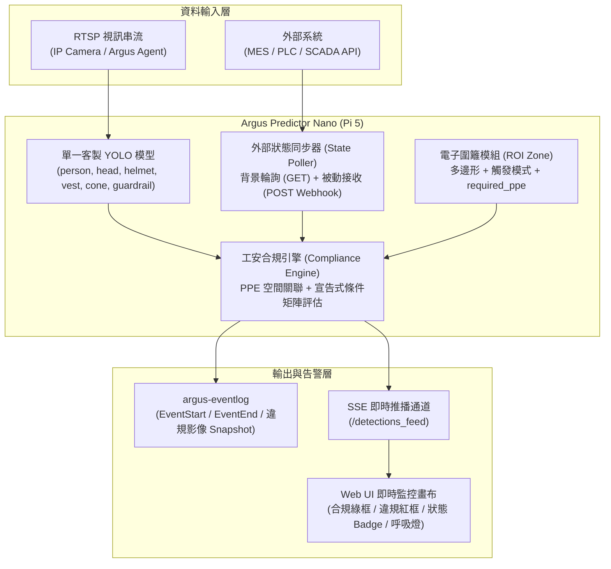

# 第 7 章：電子圍籬與 PPE 工安防護規範

本章說明 Argus Safety Predictor Nano 的人員裝備防護（PPE, Personal Protective Equipment）檢測、條件式工安合規規則引擎（Compliance Rule Engine）、外部設備狀態雙軌同步，以及在全螢幕監控畫布上的即時合規與違規視覺判讀。

---

## 功能概述

在現代製造業廠房與工程作業中，工安要求往往具備高度情境依賴性（Context-Aware）。傳統單一物件偵測或單純多邊形入侵偵測無法滿足複雜的工安稽核需求。本系統提供四大核心防護能力：

1. **PPE 防護裝備檢測與雙模判定**：自動檢測人員是否配戴安全帽（`helmet`）與反光背心（`vest`），並提供專利級防誤判幾何演算法。
2. **外部設備狀態即時感知 (External Equipment States)**：透過 HTTP 輪詢或 Webhook 動態獲取機台運轉模式（如 `MAINTENANCE` 維護中、`RUNNING` 運轉中、`ALARM` 異常）。
3. **宣告式複合工安條件規則矩陣 (Declarative Compliance Rules)**：在特定機台狀態與區域下，強制要求現場必須設置安全阻隔物（如三角錐 `cone`、護欄 `guardrail`）與全員裝備齊全。
4. **即時雙色合規/違規視覺畫布與標準事件日誌**：全螢幕高解析度畫布以終端機綠框標示合規、紅色警示框與醒目橫幅標註違規原因，並自動擷取清晰事件快照留存。



---

## PPE 防護裝備檢測策略

為兼顧不同攝影機安裝角度（遠距俯視 vs 近距遮擋）與現場人員姿態（站立、彎腰、蹲下、側身），系統支援兩種 PPE 比對策略：

### 1. 直接負類別模式 (`direct_negative`)（系統預設）

- **運作原理**：直接依據 YOLO 模型輸出的負類別標籤（`no_helmet`、`no_vest`）進行違規判定。若區域內出現未戴安全帽或未穿背心標籤，即刻判定違規。當電子圍籬未明確指定 `ppe_strategy` 時，系統預設採用此模式。
- **適用場景**：攝影機為高角度俯視、光線均勻、視野開闊且人員遮擋較少的區域（如走道、大廳、開放式倉儲區）。
- **優點**：運算最簡、反應直接。

---

### 2. 頭部錨點包含度比對模式 (`head_anchor`)（推薦）

- **運作原理**：
  1. 系統以人員框內的頭部偵測（`head`）作為錨點。
  2. 計算頭部與安全帽（`helmet`）的邊界框交集（$\text{IoU} \ge 0.15$）或包含度（$\text{Containment} \ge 0.25$）。
  3. 若頭部未被安全帽覆蓋或與 `no_helmet` 重疊，即判定為缺失安全帽 (`missing_helmet`)。
- **彎腰與遮擋防誤判機制**：
  現場人員在機台前進行檢修、彎腰或蹲下作業時，人體與頭部外觀往往產生形變。`head_anchor` 策略採用鬆散空間包含度比對（Loose Box Containment $\ge 0.4$），只要安全帽位於人體合理範圍內即可精準關聯，大幅降低因作業姿勢造成的工安誤報。
- **適用場景**：機台門前作業區、複雜管線區、密集作業站點等人員肢體常有角度變化或部分遮擋之處。

---

## 外部設備狀態整合 (External Equipment States)

工安防護等級往往需與現場設備運行狀態連動。Argus Predictor Nano 支援「背景輪詢」與「Webhook 接收」雙軌同步機制：

### 1. 方式一：背景自動輪詢 (HTTP GET Polling)

系統在背景啟動獨立 Daemon 執行緒，定時向外部系統（如 MES / PLC / SCADA REST API）發送 GET 請求取得最新設備狀態並快取於記憶體中。

在 `config.yaml` 中的 `external_states` 區塊配置範例：

```yaml
external_states:
  stocker_01:
    url: "http://mes-api.factory.internal/api/v1/equipment/STK01/status"
    method: "GET"
    interval_seconds: 5       # 輪詢間隔秒數 (預設 5 秒)
    json_path: "data.status"   # 狀態值之 JSON 巢狀路徑
    timeout_seconds: 2        # 請求逾時門檻 (預設 2 秒)
    fallback_value: "UNKNOWN"  # 逾時或斷線時的預設降級狀態
```

- **巢狀 JSON 解析**：支援點分隔路徑（如 `data.equipment.status` 或 `result.mode`）。
- **故障安全機制 (Fail-Safe)**：當外部 API 網路中斷、HTTP 5xx 錯誤或逾時，狀態自動降級為 `fallback_value`，避免規則引擎誤判。

---

### 2. 方式二：外部 Webhook 主動推送 (POST API)

若外部系統（如 PLC 閘道器、MES 事件觸發器）具備主動推送能力，可直接呼叫 Argus Predictor Nano 開放的 REST API：

- **請求端點**：`POST /api/external_state`
- **請求標頭**：`Content-Type: application/json`
- **Payload 格式**：

```json
{
  "source": "stocker_01",
  "status": "MAINTENANCE",
  "ttl_seconds": 60
}
```

- **TTL 自動過期保護**：可選擇性帶入 `ttl_seconds`（存活時間秒數）。若外部系統在指定時效內未再發送新狀態，該設備狀態將自動回退至 `fallback_value`，防止設備重啟後遺留過期狀態。

---

### 3. 查詢目前設備狀態

可透過 GET 請求即時檢視目前記憶體中快取的設備狀態與合規總覽：

- **請求端點**：`GET /api/compliance_status`
- **回應範例**：

```json
{
  "external_states": {
    "stocker_01": "MAINTENANCE"
  },
  "compliance": {
    "active_zone": "Stocker02_DoorArea",
    "status": "VIOLATION",
    "violations": ["safety_barrier_missing"],
    "missing_barriers": ["cone", "guardrail"]
  }
}
```

---

## 宣告式複合工安條件規則矩陣 (Compliance Rules)

透過 `config.yaml` 中的 `compliance_rules` 陣列，使用者可以宣告結構化的多條件工安防護規範：

```yaml
compliance_rules:
  - id: "maintenance_barrier_and_ppe_rule"
    name: "機台保養安全防護規範"
    enabled: true
    when:
      external_state:
        stocker_01: "MAINTENANCE"   # 條件 1: 機台處於保養模式
      zone: "Stocker02_DoorArea"    # 條件 2: 發生於指定電子圍籬內
      detected: ["person"]          # 條件 3: 區域內出現作業人員
    require_any: ["cone", "guardrail"]     # 需求 A: 畫面中需至少存在三角錐或安全護欄之一
    require_ppe: ["helmet", "vest"]        # 需求 B: 區域內作業人員必須戴安全帽並穿反光背心
    on_violation:
      severity: "HIGH"
      category: "safety_barrier_missing"
```

### 規則欄位結構詳解：

| 欄位名稱 | 型態 | 說明 |
|---|:---:|---|
| **`id`** | 字串 | 規則唯一識別碼（如 `maintenance_barrier_and_ppe_rule`）。 |
| **`name`** | 字串 | 規則易讀名稱（用於 UI 呈現與事件日誌說明）。 |
| **`enabled`** | 布林 | 是否啟用此規則（`true` / `false`）。 |
| **`when.external_state`** | 字典 | 觸發此規則時所需滿足的設備狀態鍵值對（如 `stocker_01: MAINTENANCE`）。 |
| **`when.zone`** | 字串 | 綁定之電子圍籬區域名稱（`zone_name`）。 |
| **`when.detected`** | 陣列 | 區域內必須出現的目標類別（如 `["person"]`）。 |
| **`require_any`** | 陣列 | 畫面中**至少需存在一項**的物件類別（例如三角錐或護欄 `["cone", "guardrail"]`）。 |
| **`require_all`** | 陣列 | 畫面中**必須全部存在**的物件類別清單。 |
| **`require_ppe`** | 陣列 | 區域內作業人員**強制穿戴**的防護裝備（如 `["helmet", "vest"]`）。 |
| **`on_violation.severity`** | 字串 | 違規事件嚴重等級（`HIGH`、`MEDIUM`、`LOW`）。 |
| **`on_violation.category`** | 字串 | 違規類別代碼（如 `safety_barrier_missing`）。 |

---

## 自訂模型類別映射 (Custom Class Mapping)

不同開源模型或自訓 YOLO 模型的標籤名稱可能有所不同（例如：`hard_hat` 代表安全帽，`safety_vest` 代表背心）。透過 `config.yaml` 中的 `ppe_class_mapping` 設定，系統能將任意標籤轉換為內部標準類別：

```yaml
ppe_class_mapping:
  person: "person"
  head: "head"
  hard_hat: "helmet"           # 將模型輸出的 hard_hat 映射至系統標準 helmet
  no_hard_hat: "no_helmet"
  safety_vest: "vest"          # 將模型輸出的 safety_vest 映射至系統標準 vest
  traffic_cone: "cone"         # 將模型輸出的 traffic_cone 映射至 cone
  safety_fence: "guardrail"    # 將 safety_fence 映射至 guardrail
```

### 系統內部標準類別名稱對照表：

| 標準類別標籤 | 類型 | 說明 |
|---|:---:|---|
| `person` | 人員 | 人體目標框 |
| `head` | 人體部位 | 頭部目標框（用於 `head_anchor` 錨點） |
| `helmet` | PPE 裝備 | 安全帽（合規） |
| `no_helmet` | PPE 負類別 | 未戴安全帽（違規） |
| `vest` | PPE 裝備 | 反光背心（合規） |
| `no_vest` | PPE 負類別 | 未穿反光背心（違規） |
| `cone` | 安全防護物 | 三角錐 / 交通錐 |
| `guardrail` | 安全防護物 | 安全護欄 / 防護圍欄 |

---

## 全螢幕即時監控與視覺判讀

開啟全螢幕即時監控視窗後，畫布會依據推論結果與合規規則即時渲染多層次視覺回饋：

### 1. 目標標註框色彩與標籤規則

- **終端機綠框 (`#00e676`) — 工安合規**：
  - 區域內依規定穿戴完整裝備之人員：標籤顯示 `[合規] person (95%)`。
  - 現場擺放之安全防護物（`cone`、`guardrail`）與防護配件（`helmet`、`vest`）。
- **警示亮紅框 (`#ff1744`) — 工安違規**：
  - 未符合 PPE 要求之作業人員：邊界框轉為 3px 亮紅色高亮，上方標籤顯示具體違規原因，例如：
    - `[違規: missing_helmet] person (91%)`
    - `[違規: missing_vest] person (88%)`
    - `[違規: missing_helmet, missing_vest] person (94%)`
- **標準警示紅框 (`#ff3333`) — 區域入侵**：
  - 未設定 PPE 規則時之一般目標區域入侵：標籤顯示 `[告警] 物件名稱 (信心度%)`。
- **紅色虛線框 — 抽檢影格**：
  - 當推論結果為非最新抽樣訊框（時間差 > 0.15 秒）時，框線呈現虛線並標註 `[抽樣]`。

---

### 2. 安全阻隔物缺失橫幅 (Missing Barriers Warning Banner)

當機台處於保養狀態且人員進入區域，但現場未擺放三角錐或護欄時，畫布於警戒多邊形起始位置上方會自動浮現醒目的紅色警告橫幅：

```text
[ 警告: 缺失安全阻隔物 (cone, guardrail) ]
```

---

### 3. 警戒區狀態徽章 (Zone Status Badge) 動態切換

全螢幕視窗頂部狀態徽章會根據現場最新狀況即時更新：

| 狀態徽章顯示 | 顏色 | 狀態說明 |
|---|:---:|---|
| `[ 警戒區：工安合規 (區域名稱) ]` | 翠綠色 (`#00e676`) | 人員位於警戒區內，且防護裝備與現場阻隔物完全合規。 |
| `[ 警戒區：工安違規 [缺少阻隔物: cone/guardrail] (區域名稱) ]` | 亮紅色 (`#ff1744`) | 觸發複合工安規則違規（缺失阻隔物或人員 PPE 不齊全）。 |
| `[ 警戒區：觸發告警 (區域名稱) ]` | 告警紅 (`#ff3333`) | 目標物件進入一般警戒區域。 |
| `[ 警戒區：已啟用 (區域名稱) ]` | 霓虹青 (`#00e5ff`) | 警戒區正常布防中，區域內無異常。 |
| `[ 警戒區：未設定 ]` | 暗灰色 (`#888888`) | 當前串流尚未劃定或啟用 ROI 警戒多邊形。 |

---

### 4. 全螢幕介面級警示呼吸燈

當發生任何工安違規或區域入侵時，全螢幕視窗四周會立即啟動紅色邊緣脈衝光暈動畫（CSS Alert Pulse），確保監控人員即使遠離螢幕亦能第一時間察覺異常。

---

## 標準事件日誌與影像快照聯動

當系統判定工安違規時，事件產製模組（`event_producer.py`）會自動產生標準化的 **ARGUS JSONL** 事件記錄：

1. **事件分類與嚴重度**：依據規則配置產出 `EventStart` 事件，帶入對應之 `category`（如 `safety_barrier_missing` 或 `missing_helmet`）與 `severity`（`HIGH`）。
2. **非同步清晰快照**：初次違規觸發時，系統自動將當下未標註的原始乾淨影像（Clean Frame）非同步寫入快照目錄：
   ```text
   recordings/{camera_id}/snapshots/{pts:.3f}_{event_ref}.jpg
   ```
   快照相對路徑會記錄於事件的 `meta.snapshot_path` 欄位，方便後續透過 UMS 平台或 VMS 進行違規事證調閱與工安稽核。
3. **事件結束去重**：當人員離開或現場補齊防護設施後，系統自動送出 `EventEnd` 事件，完整記錄違規持續時間。

---

## 完整 `config.yaml` 配置範例

以下為整合 PPE 映射、外部狀態輪詢、電子圍籬與複合工安規則的完整設定範例：

```yaml
# 1. 自訂模型類別映射
ppe_class_mapping:
  person: "person"
  head: "head"
  helmet: "helmet"
  no_helmet: "no_helmet"
  vest: "vest"
  no_vest: "no_vest"
  cone: "cone"
  guardrail: "guardrail"

# 2. 外部設備狀態來源 (支援多組)
external_states:
  stocker_01:
    url: "http://mes-api.factory.internal/api/v1/equipment/STK01/status"
    method: "GET"
    interval_seconds: 5
    json_path: "data.status"
    timeout_seconds: 2
    fallback_value: "UNKNOWN"

# 3. 電子圍籬設定
zones:
  rtsp://127.0.0.1:8554/camera_wallclock:
    zone_name: "Stocker02_DoorArea"
    polygon:
      - [0.455, 0.468]
      - [0.427, 0.625]
      - [0.601, 0.610]
      - [0.565, 0.475]
    trigger_mode: "intersect"
    sensitivity: 0.0
    ppe_strategy: "head_anchor"       # "head_anchor" (推薦) | "direct_negative" (預設)
    required_ppe: ["helmet", "vest"] # 需檢查之防護裝備

# 4. 複合工安條件規則矩陣
compliance_rules:
  - id: "maintenance_barrier_and_ppe_rule"
    name: "機台保養安全防護規範"
    enabled: true
    when:
      external_state:
        stocker_01: "MAINTENANCE"
      zone: "Stocker02_DoorArea"
      detected: ["person"]
    require_any: ["cone", "guardrail"]
    require_ppe: ["helmet", "vest"]
    on_violation:
      severity: "HIGH"
      category: "safety_barrier_missing"

# 基礎系統設定
mode: "rtsp"
fps_limit: 2
cpu_cores: 4
conf_threshold: 0.25
```

---

## 注意事項

- **推論效能保證**：本系統所有 PPE 關聯分析、空間幾何比對與規則評估均在記憶體中以輕量演算法執行，運算耗時小於 0.2 毫秒，不會降低 Raspberry Pi 5 邊緣推論幀率。
- **熱重載支援**：修改 `config.yaml` 中的 `ppe_class_mapping`、`external_states` 或 `compliance_rules` 後，點擊介面 `「[ EXECUTE_UPDATE ]」` 即可立即熱生效。
