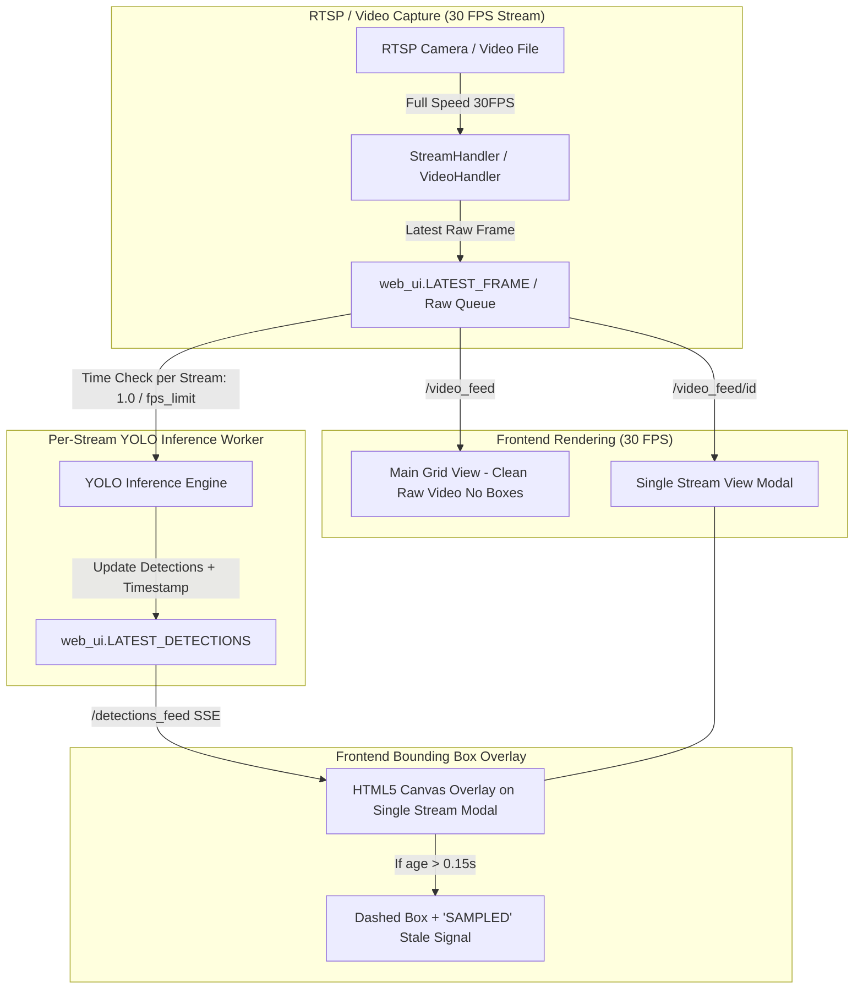

# Implementation Plan - 高幀率畫面與推論抽樣解耦及動態畫框機制 (已透過 /grill-me 對齊需求)

本計劃旨在重構 **Argus Safety Predictor Nano** 的影像串流與推論架構，實現以下目標：
1. **前端串流高幀率維持**：前端 MJPEG 串流與單路串流保持 30 FPS 高流暢度與零延遲（不隨 `fps_limit` 降低而卡頓或慢動作）。
2. **Inference 按 `fps_limit` 獨立抽樣**：每路串流獨立依據 `fps_limit` 的設定頻率進行推檢（例如 `fps_limit = 2` 代表每路每秒執行 2 次推論）。
3. **主畫面乾淨不畫框**：主畫面 (Grid View) 僅顯示原始清晰影像，不安裝/繪製任何 Bounding Box。
4. **單路焦點檢視時才畫框**：使用者點擊特定串流進入單路視窗 (Modal) 時，由前端 HTML5 Canvas 透過 SSE (`/detections_feed`) 動態畫框。
5. **過時方框 UI 提示訊號**：單路畫框時，若該方框為抽樣過渡期（時間差 > 0.15 秒），方框樣式轉換為虛線邊框並顯示過時/抽樣標籤（如 `[SAMPLED]`），提醒使用者畫面為即時 30 FPS 但推論方框為抽檢結果。
6. **影片倒帶歷史清空**：影片循環倒帶回第 0 幀瞬間，清空該串流之偵測歷史，避免舊方框殘留。

---

## User Review Required

> [!IMPORTANT]
> **對齊之設計決策與變更點**：
> 1. `StreamHandler` 取消在接收 RTSP 幀時的 `time.sleep(1.0 / fps_limit)`，改為全速（30 FPS）持續解碼並更新最新幀佇列，徹底解決慢動作與延遲問題。
> 2. 後端 Python 程式（`video_handler.py` 與 `grid_composer.py`）全面停止直接在 OpenCV 影像矩陣上繪製方框。所有方框繪製統一轉交由前端 HTML5 Canvas overlay 處理。
> 3. `_inference_worker`（背景推論線程）為每路串流獨立控管 `fps_limit` 時間間隔抽檢。
> 4. 前端 Canvas 在方框時間戳記過期（> 0.15秒）時自動劃分虛線框與標註 `[SAMPLED]` 提示訊號。

---

## Proposed Changes



### Component 1: `stream_handler.py`
#### [MODIFY] `stream_handler.py`
- 移除 `_capture_frames` 迴圈中的 `time.sleep(1.0 / self.fps_limit)`。
- 改為持續以全速 `cap.read()` 讀取最新影格，並加入微小 `time.sleep(0.001)` 避免 CPU 死鎖。確保 OpenCV 的解碼 buffer 永遠為空（零延遲），並維持 30 FPS 畫面。

---

### Component 2: `video_handler.py`
#### [MODIFY] `video_handler.py`
- 移除在 `_play_video` 中使用 `cv2.rectangle` 與 `cv2.putText` 繪製方框的邏輯。
- 當影片倒帶（`cap.set(cv2.CAP_PROP_POS_FRAMES, 0)`）時，呼叫清空 `latest_detections` 邏輯。
- 直接編碼原始 clean 畫面並更新至 `web_ui.LATEST_FRAME`。

---

### Component 3: `main.py`
#### [MODIFY] `main.py`
- 修改 `_inference_worker` 邏輯：維護每個 stream 的 `last_infer_time`。
- 只有當 `current_time - last_infer_time >= (1.0 / fps_limit)` 時，才對該 stream 執行 YOLO 推論，並將 `ts = time.time()` 帶入 `web_ui.LATEST_DETECTIONS` 中。
- 移除主迴圈中強行 `time.sleep(1.0 / fps_limit)` 導致影片慢動作的寫法。

---

### Component 4: `templates/index.html`
#### [MODIFY] `templates/index.html`
- 主畫面保持 clean，不觸發/繪製方框。
- 點擊特定 Stream 進入彈出視窗 (`openFullscreen(streamId)`) 時，啟用 SSE HTML5 Canvas 畫框機制。
- 在 `drawCanvas()` 裡面檢查 `detObj.ts` 與 `Date.now()/1000` 的時間差：
  - 若時間差超過 0.15 秒（表示當前方框為舊抽檢結果），使用 `ctx.setLineDash([4, 4])` 繪製虛線框，並在標籤旁加入 `[SAMPLED]` 提示。
  - 若時間差在 0.15 秒以內（新推論到位），切換回實線框 `ctx.setLineDash([])`。

---

## Verification Plan

### Automated / Syntax Tests
- 執行語法檢查：
  ```powershell
  python -m py_compile main.py stream_handler.py video_handler.py web_ui.py
  ```

### Manual Verification
1. 啟動應用程式：
   ```powershell
   python main.py
   ```
2. 開啟瀏覽器訪問 `http://localhost:8188`。
3. **驗證 1（高幀率無慢動作）**：將 `fps_limit` 設為 `2`，主畫面與單路畫面皆維持 30 FPS 極速順暢，完全無慢動作。
4. **驗證 2（主畫面無框）**：主畫面 (Grid View) 呈現純淨影像，無任何方框。
5. **驗證 3（單路畫框 + 過時提示訊號）**：點擊單路視窗，當 `fps_limit = 2` 時，觀察方框在每 0.5 秒的新推論到達前會呈現虛線框與 `[SAMPLED]` 提示，收到新推論瞬間閃爍切換為實線，清晰提示使用者該方框為抽檢結果。
6. **驗證 4（影片倒帶清空）**：影片倒帶回 0 秒瞬間，確認舊框立即消失重置。
